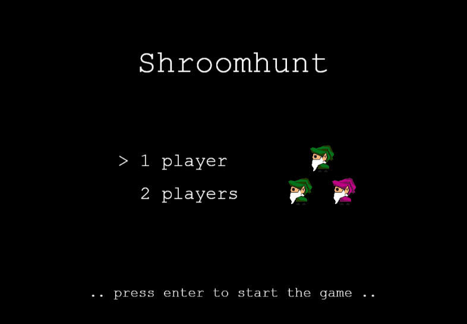
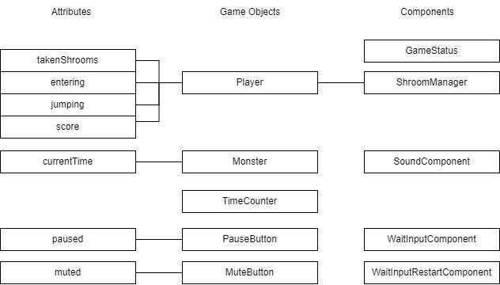

# Shroomhunt

> **Shroomhunt** is 2D platform game with two player game mode. It was made as a semestral work. Game is [available online](https://shroomhunt.netlify.app).

## Intend and execution

The idea of gameplay is from an old PC game called Herkules.

## Technical

The project is powered by ParcelJS, TypeScript, PixiJS and ECSLite libraries.

### How to run this project locally

- install [NodeJS](https://nodejs.org/en/download/)
- execute `npm install`
- execute `npm run dev`
- go to [http://localhost:1234](http://localhost:1234)

### Game objects diagram

## Asset source
- graphical assets - hoskra
- background music - DJ Pes (specially made for this game)
- sound effects - [opengameart](https://opengameart.org/content/rpg-sound-pack)